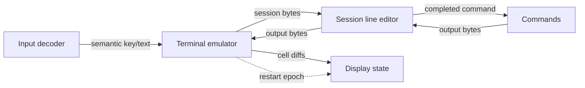

# Terminal service flow

The active terminal path is a bounded graph of five ELF-loaded ring-3 services. Hardware and pixels
are represented by adapter boundaries; the terminal state machine owns neither. Session only edits
input lines; Commands owns built-in execution.

Each edge is a fixed queue of eight entries. Payloads are copied into fixed-size messages. A full
queue returns an error; it never overwrites an unread entry. Endpoint generations and service
epochs reject late messages after a replacement.

The live supervisor stops every service task at a scheduler boundary, reclaims process mappings,
page-table frames, image frames, and IPC pages, then rebuilds the graph with a new endpoint
generation. Late messages from the previous generation are rejected.

The restart path is deliberately volatile: terminal/session state and in-flight commands are not
saved for a later reboot. A reboot starts from the fixed boot image and creates a new graph. Future
reboot recovery belongs to a storage service backed by a proto-filesystem, with separate journal and
idempotency proofs.

This document describes the terminal contract path. The current QEMU proof validates service image
loading, isolated roots, framebuffer and keyboard mappings, ring-3 entry, rendering, semantic input,
fault containment, and one deterministic supervisor-driven restart.
