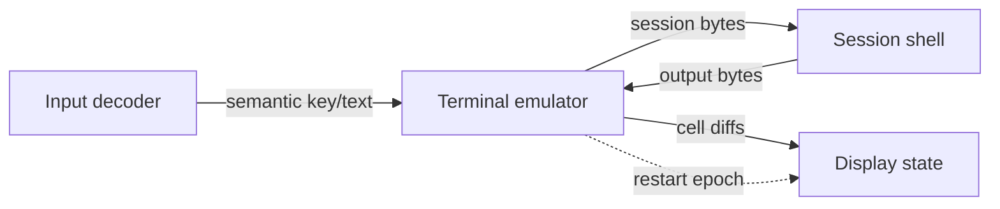

# Terminal service flow

The active terminal path is a bounded graph of five ELF-loaded ring-3 services. Hardware and pixels
are represented by adapter boundaries; the terminal state machine owns neither. `TerminalStack` is
kept as a host reference model for protocol tests.

Each edge is a fixed queue of eight entries. Payloads are copied into fixed-size messages. A full
queue returns an error; it never overwrites an unread entry. Endpoint generations and service
epochs reject late messages after a replacement.

The host reference model can clear its screen model, advance its endpoint identity, rebind Display,
and request a fresh Session prompt. Live endpoint generations are prepared for the supervisor, but
live service restart and page-table teardown are not yet part of the boot acceptance proof.

This document describes the terminal contract path. The current QEMU proof validates service image
loading, isolated roots, framebuffer and keyboard mappings, ring-3 entry, rendering, semantic input,
and fault containment. It does not yet claim live restart recovery.
