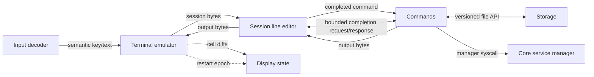

# Terminal service flow

The active terminal path is a bounded graph of six ELF-loaded ring-3 services. Hardware and pixels
are represented by adapter boundaries; the terminal state machine owns neither. Session only edits
input lines; Commands owns built-in execution and sends file operations to Storage through a versioned
bounded API.

Each edge is a fixed queue of eight entries. Payloads are copied into fixed-size messages. A full
queue returns an error; it never overwrites an unread entry. Endpoint generations and service
epochs reject late messages after a replacement.

The live supervisor stops every service task at a scheduler boundary, reclaims process mappings,
page-table frames, image frames, and IPC pages, then rebuilds the graph with a new endpoint
generation. Late messages from the previous generation are rejected.

The restart path is deliberately volatile for terminal/session state and in-flight commands. File
state is owned by Storage: mutating commands use one Begin → operation → Commit transaction, while
reads use committed state unless an API caller supplies the active transaction ID. A reboot starts
from the fixed boot image, reopens the durable namespace, and discards any uncommitted transaction.

Commands exposes `service["name"].status`, `service["name"].start()`, `service["name"].stop()`, and
`service["name"].restart()` as a typed text adapter over the versioned Core manager ABI. The manager
validates a private, process-bound capability before changing lifecycle state; a future GUI shell can
use the same request/response values without parsing terminal output.

Session also sends bounded completion requests to the Commands image over the existing reverse queue.
Commands resolves root expressions, live service names, service and network members, and the fixed
`eth0` interface entry. Completion is a best-effort sub-service: malformed, unavailable, or timed-out
requests produce one Session diagnostic and disable completion for that Session, without affecting
input or command execution. A Commands process crash still follows the normal graph-restart policy.

This document describes the terminal contract path. The current QEMU proof validates service image
loading, isolated roots, framebuffer and keyboard mappings, ring-3 entry, rendering, semantic input,
bounded file commands, durable reopen, torn-journal recovery, fault containment, and one deterministic
supervisor-driven restart.
