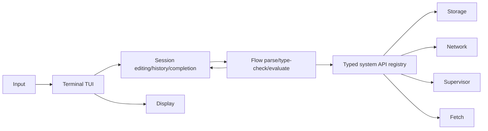

# Terminal service flow

The terminal path is deliberately layered:

Session owns line editing, history, proactive completion requests, the bounded rotating inline
completion window, active ghost acceptance, and prompt state. Flow owns source spans, typed operation
lookup, fixed variables, promise slots, cancellation, diagnostics, and dispatch.
Storage, Network, Supervisor, and Fetch retain ownership of their state and expose only bounded IPC
operations.

All queues are fixed-capacity and generation-checked. Restarting Session or Flow drops volatile
variables, pending promises, and foreground work; durable Storage state remains intact. Ctrl-C is
forwarded as Flow cancellation only while a foreground evaluation is active. A stale completion or
operation response is ignored without changing the current prompt.
