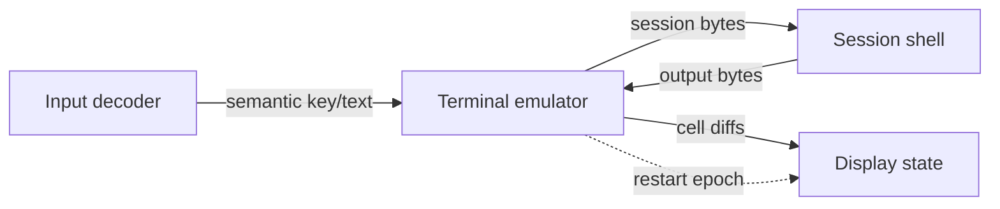

# Terminal service flow

The active terminal proof is a bounded service graph. Hardware and pixels are represented by
adapter boundaries; the terminal state machine owns neither.

Each edge is a fixed queue of eight entries. Payloads are copied into fixed-size messages. A full
queue returns an error; it never overwrites an unread entry. Endpoint generations and service
epochs reject late messages after a replacement.

Terminal restart clears its screen model, advances its endpoint identity, rebinds Display, and
requests a fresh Session prompt. Session state is retained by the proof graph; terminal scrollback
is not restored.

This document describes the terminal contract path. Its current hardware proof is a separate fixed
ring-3 task that validates entry and fault containment; the terminal service itself is not yet an
ELF-loaded process and does not own capability mappings.
