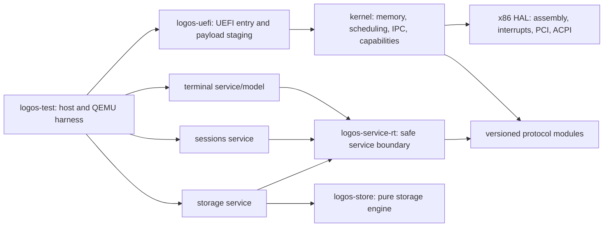

# LogOS codebase review — 2026-07-31

Status: active review. This is an evidence-backed improvement backlog, not an architectural rewrite proposal.

## Executive judgement

The project has a good foundation: the workspace already contains useful pure crates (`logos-abi`, `logos-core`, `logos-store`, `logos-terminal`), the onion-ring intent is documented, the store and terminal models have host tests, and the QEMU runner emits structured artifacts.

The long-term risk is that the repository is currently halfway between two architectures:

- a single UEFI kernel crate that owns boot, hardware, IPC, policy, service loading, terminal behavior, and recovery; and
- a service-oriented system whose boundaries are represented by separate crates and native payloads.

The next milestone should make those boundaries truthful and testable before adding more subsystems. The highest-value work is not “split every folder into a crate”; it is to move ownership behind small contracts, then make the build and test gates enforce those contracts.

## Review baseline

Verified on 2026-07-31:

- `cargo fmt --check --all` passes.
- Host tests pass for the extracted crates: `logos-abi`, `logos-core`, `logos-service-rt`, `logos-store`, `logos-terminal`, and `logos-test`.
- The UEFI package and the three service payload packages build for `x86_64-unknown-uefi` when selected explicitly.
- `cargo clippy --workspace --all-targets --all-features -- -D warnings` does not currently describe a valid target matrix: it reaches missing panic handlers for service binaries and a duplicate panic implementation for the UEFI package's host test target.
- `cargo test --features test,mock_hal --lib` is stale: those features do not exist in the current workspace.
- `cargo build --target x86_64-unknown-uefi` uses `default-members`, which excludes the root UEFI package and service packages.
- QEMU/OVMF is not installed in this environment, so the boot path was not run here.
- `scripts/arch-deps.py --check` exits successfully but only scans top-level `src/*.rs`; it does not inspect nested modules or workspace crates. Its CI job is also `continue-on-error`.

These results mean the project has passing pieces, but no single green command currently proves “the project works.” Fix that before trusting future refactors.

Key evidence: [workspace manifest](../../Cargo.toml), [kernel orchestrator](../../src/kernel.rs), [native service ABI](../../crates/logos-core/src/native_service.rs), [service runtime](../../crates/logos-service-rt/src/lib.rs), [QEMU harness](../../crates/logos-test/src/main.rs), and [verification workflow](../../.github/workflows/verify.yml).

## Boundary rule

Split code when all four are true:

1. one owner can explain the invariants;
2. the boundary has a small typed API;
3. the implementation can be tested or built independently; and
4. failure, resource ownership, and versioning are explicit.

Do not split merely because a directory name resembles a ring. The ring documents ownership and dependency direction; a crate, function call, IPC channel, or syscall is selected by the required isolation. This preserves the rule in `AGENTS.md` and avoids a forest of thin crates with no real independence.

## Priority backlog

### P0 — make the current architecture truthful

#### 1. Establish one real build/test gate

The workspace mixes host-testable libraries, UEFI-only binaries, and a host QEMU harness. Replace the current “all targets/all features” command with an explicit matrix:

- host lint/test: only host-testable packages;
- UEFI lint/build: the root package plus every UEFI service package, with `--target x86_64-unknown-uefi` and no host test targets;
- QEMU suite: the structured `logos-test` runner;
- documentation and architecture validation: required, not advisory.

Update `.pre-commit-config.yaml`, `scripts/check.ps1`, and `.github/workflows/verify.yml` to call the same small set of scripts. Give every command a stable name and artifact directory so a contributor can reproduce a CI failure locally.

#### 2. Repair CI before expanding it

The current verification workflow has several correctness failures:

- it calls `./scripts/verify.ps1` directly on Ubuntu without invoking PowerShell;
- it expects `target/.../logos.efi`, while the package target is `logos-uefi.efi`;
- it builds only Cargo `default-members` in the generic UEFI step;
- the architecture check is allowed to fail;
- host Clippy and host tests use the removed `test,mock_hal` feature command;
- documentation checks reference missing `.markdown-link-check.json`, `.cspell.json`, `.markdownlint.json`, and `.codespellrc` files;
- workflows disagree on `main` versus `master` and overlap in responsibility;
- the performance workflow currently swallows failure with `|| true` and does not record a deterministic boot metric.

Make one workflow authoritative, use one branch policy, pin third-party actions to reviewed immutable references, set read-only permissions, and cancel superseded runs. A green check must mean something.

#### 3. Finish or explicitly defer persistence

`logos-storage-service` currently initializes a heap and loops on input; it does not use `logos-store`, dispatch store operations, or implement the block path. The kernel also contains `StoreEndpoint`/`BlockEndpoint` scaffolding marked dead code. `docs/PERSISTENCE.md` correctly marks much of this as incomplete.

Choose one honest milestone:

- implement one vertical slice: request → storage service → `logos-store` → block abstraction → restart/recovery test; or
- mark persistence as scaffold-only everywhere and keep it out of “complete” status.

Do not add more persistence abstractions until this slice works under malformed input, full storage, restart, and power-loss simulation. Keep `logos-store` as one crate; its current host-testable format engine is already a useful boundary.

### P1 — make ownership and contracts real

#### 4. Thin the UEFI root and the kernel orchestrator

`src/main.rs` declares the whole kernel, and `src/kernel.rs` is a large boot orchestrator that runs memory, VM, capability, supervisor, driver, IPC, service, terminal, and recovery setup in one function. This makes every change compile against every concern and makes failures hard to localize.

Extract in this order, preserving behavior after each step:

1. boot stages and their result types;
2. self-checks into a testable `startup_checks` module;
3. service lifecycle/bootstrap policy out of the main loop;
4. terminal bootstrap adapters out of the kernel;
5. only then consider a separate `logos-kernel` library and `logos-uefi` binary.

The first seam should be functions and typed state, not a new crate. Create a crate only when the extracted block has an independent target, owner, or test strategy.

#### 5. Remove outer terminal knowledge from the kernel

The root package directly depends on `logos-terminal`, and `src/kernel.rs` imports terminal, text, display, and input model types. That makes a Core/boot package know an Experience/Sessions implementation. Keep only foundational device-facing input/display contracts in the kernel; keep terminal parsing, history, rendering policy, and command behavior in the terminal service/model.

This is the clearest current onion-ring violation. It should be removed before adding another outer service.

#### 6. Separate policy from mechanism in `src/platform` and `src/drivers`

`src/platform` mixes boot identity, secrets, storage, payload staging, service registry, health, tracing, and service protocol state. `src/drivers/supervisor.rs` contains supervisor policy, manifests, capability grants, health, restart, and replacement logic even though it lives under `drivers`. `src/platform/services.rs` reaches back into the driver supervisor.

Move by ownership, not by filename:

- hardware access and device discovery: HAL/driver layer;
- page tables, allocators, scheduling, interrupt-safe IPC: kernel mechanism;
- manifests, capability delegation, lifecycle, restart, and recovery policy: system/supervisor layer;
- terminal and session behavior: replaceable services;
- boot-only UEFI persistence and payload staging: boot adapter with a narrow kernel handoff.

Until a second architecture needs the code, these can remain modules inside the kernel package. The important change is that the public dependency direction becomes visible.

#### 7. Make the native service boundary typed

`logos-core::native_service::Context` currently carries input, display, session, effect, store, and block operations in one shared page. Service binaries then receive a raw pointer, mutate the context directly, and issue `int 0x80` inline assembly themselves.

Make `logos-service-rt` the only owner of this unsafe boundary:

- one safe `Context` wrapper;
- typed request/reply views;
- checked lengths and operation/state transitions;
- one syscall submission primitive;
- no raw pointers or inline assembly in service `main.rs` files.

Keep the wire layout in a small native ABI module. Do not make every service depend on the entire operation universe: expose one contract module per protocol, initially within `logos-abi` if that avoids needless crate multiplication.

#### 8. Version protocols independently

`logos-abi` is a sensible shared crate, but it currently groups block, store, session, effects, input, display, and native context concepts together. The native context has a single ABI number, while individual protocol evolution is not independently negotiated.

First split the source into protocol modules and give each protocol a version, operation/state table, maximum sizes, and negative tests. Only create separate crates when consumers or release cadence actually diverge. Replace wire-facing `usize` fields with fixed-width integers and add compile-time size/alignment assertions; `usize` makes a wire layout architecture-dependent.

The native bootstrap frame should be separate from the long-lived service contracts. A service should not need to understand block, store, display, and session operations just because the shared page can carry them.

#### 9. Make supervisor authority enforceable

Current manifests mainly list capability kinds, and grants are not scoped by resource, provenance, parent delegation, expiry, or revocation lineage. Replacement is also largely a checked closure rather than a supervisor-owned lifecycle record.

Before System delegation, specify and test:

- who owns each capability and resource;
- attenuation rules and scope representation;
- parent/provenance and revocation behavior;
- expiry or lease semantics, if needed;
- restart/replacement state machine;
- reclaim behavior after crash;
- denial and audit behavior.

The existing fixed capability table is acceptable for bootstrap. Do not add a general capability framework until a real delegation use case requires it; make the current limitations explicit instead.

### P1 — remove hidden correctness and security debt

#### 10. Contain unsafe code and hardware assembly

There are roughly 320 `unsafe`/assembly-related lines across `src` and `crates`, but only a small number of `SAFETY:` explanations. Inline assembly appears in IPC, tracing, kernel/service paths, and identity code rather than behind one hardware interface.

Create a narrow HAL boundary for x86 assembly and interrupt state. Callers should use safe or explicitly unsafe wrappers with documented preconditions. Add `unsafe_op_in_unsafe_fn` policy and require a `SAFETY:` explanation for every remaining unsafe block. This is especially important before SMP: global `UnsafeCell` state and `unsafe impl Sync` currently rely on bootstrap single-CPU assumptions.

#### 11. Make memory ownership transactional

The memory code has fixed resource limits, which is appropriate for early boot, but several limits fail ambiguously:

- memory-map ranges beyond the fixed eight-entry table are ignored;
- `release_page` does not validate alignment or detect double release;
- contiguous release can partially return pages before reporting failure;
- `map_heap` can leave already-mapped pages behind when a later allocation fails;
- service heap placement is derived from magic page offsets around the context page;
- the payload staging buffers silently cap each payload at 512 KiB.

Either prove each bound in a platform contract or make overflow a visible boot failure. Use ownership/rollback guards for multi-page operations. Put the service memory layout in a versioned bootstrap description rather than duplicating offsets in the address-space mapper and storage service.

#### 12. Replace invariant panics on service paths with structured failure

The kernel and services contain `unwrap`, `expect`, `unreachable`, and direct assertions in paths that can become externally influenced after service restart or malformed input. Examples include terminal handles in `kernel.rs`, session request handling, fixed-size text copying, and audit recording.

Keep assertions for internal proofs and self-checks, but turn boundary failures into typed denial, health failure, or recovery transitions. In particular, `debug_assert!(audit.record(...))` must not be the only check when the operation has already modified state: audit capacity failure should fail closed or roll back.

#### 13. Define secret and identity lifecycle

The current root-key and machine-identity code uses UEFI variables when available and falls back to entropy or a volatile timestamp-derived identity. That may be acceptable for a non-secret bootstrap identity, but the trust level must be explicit. Never let a timestamp-derived value silently become a security root.

The fixed secret store also has no visible deletion/read lifecycle, copies secret bytes, and does not wipe stored bytes on removal or teardown. Before exposing it to a service, define ownership, zeroization, persistence failure semantics, and audit behavior. Prefer a small explicit lifecycle over a future cryptography abstraction.

#### 14. Specify IPC concurrency assumptions

`ipc::Channel` combines `UnsafeCell`, a hand-rolled spin lock, interrupt enable/disable, and a wrapping `u16` request ID. The lock has no guard-based release, and the global synchronization assumptions are not an enforceable SMP boundary.

Document whether IPC is interrupt-context-safe, CPU-local, or globally serialized. Add a guard that restores interrupt state on every exit path, then add generation/epoch handling for request ID reuse. Before SMP, replace the single global mutable queue with a deliberate per-CPU or synchronized design; do not let the current bootstrap shortcut become an accidental architecture.

### P2 — make the development loop scale

#### 15. Define the workspace contract

Add workspace-level package metadata, `rust-version`, lints, profiles, and a pinned toolchain/target policy. Mark UEFI-only binary tests explicitly and document which packages are host-testable. Keep `Cargo.lock` checked in.

The intended package roles should be obvious from manifests:

| Package | Role | Must be host-testable? |
| --- | --- | --- |
| `logos-abi` | fixed-width protocol types and validation | yes |
| `logos-core` | small platform-independent kernel state machines | yes |
| `logos-store` | crash-safe storage format/engine | yes |
| `logos-service-rt` | service entry, typed context, allocation contract | target plus host protocol tests |
| `logos-terminal` | pure terminal model/rendering policy | yes |
| `logos-uefi` / service payloads | hardware-facing binaries | UEFI/QEMU |
| `logos-test` | host orchestration and artifact generation | yes |

If a package cannot state its role in one sentence, it is probably crossing a boundary.

#### 16. Make architecture validation authoritative

Replace or repair `scripts/arch-deps.py`. It currently scans only `src/*.rs`, has a stale module-to-ring map, and cannot see Cargo crate dependencies. The durable check should validate:

- workspace crate dependency edges;
- explicit allowed ring edges;
- no kernel dependency on terminal implementation crates;
- no service dependency on private kernel modules;
- no raw ABI/assembly use outside approved boundary files.

Use Cargo metadata as the source for crate edges and a small checked-in mapping for ring ownership. Fail CI on violations. Generate a graph as a report, not as the policy itself.

#### 17. Make host and QEMU testing complementary

The structured `logos-test` runner is the right direction: it provides scenarios, JSON/JUnit output, and serial artifacts. Make it canonical and either remove or rewrite `scripts/verify.ps1`, which currently parses human debug markers and duplicates the test protocol.

Add one small negative test per boundary: malformed ABI length, invalid operation transition, stale generation, capability denial, full queue, page allocation rollback, service restart, and store recovery. Keep pure logic in host-testable crates; reserve QEMU for boot, target ABI, interrupt, memory-map, device, and service integration behavior.

Skipped future scenarios should be visible in CI and tied to the current milestone. A suite that exits zero while silently skipping the next milestone is useful only if the skip is reported and intentional.

#### 18. Add a boundary definition of done

Every new subsystem or extracted block should land with:

- one owner and one source directory;
- a minimal typed API and version/state table;
- explicit capability/resource ownership;
- bounded input and failure/recovery behavior;
- host tests for pure logic;
- one QEMU scenario where target behavior matters;
- diagnostics and artifact output;
- architecture/status documentation;
- an ADR only when the decision is irreversible or cross-ring.

This turns the existing milestone policy into a repeatable development habit rather than a checklist consulted after implementation.

#### 19. Remove documentation drift

The documentation currently has multiple truth sources:

- `AGENTS.md` and `docs/TODO.md` describe Platform v1 as current;
- `docs/ROADMAP.md` says Persistence v1 is current;
- README links use lowercase names while the repository uses uppercase filenames;
- architecture and console documents differ on whether dedicated text/display contracts are complete;
- `docs/review` and `docs/reviewed` split active and archived reviews without an index;
- the archived quality review contains stale absolute `file:///` links to pre-extraction paths;
- the test README says the runner never sleeps, while the runner uses polling sleeps.

Choose one milestone status source, make README/AGENTS/roadmap link to it, and make completed claims point to a test or artifact. Repair links with repository-relative paths and avoid absolute local paths in committed Markdown.

#### 20. Keep ADR and release evidence in the repository

The workflow generates an ADR index as an artifact but does not validate or update the checked-in `docs/adr/README.md`. Generate the index deterministically and fail if the committed index differs. Likewise, release readiness should build every payload, verify exact names and hashes, validate the ESP contents, and run the same smoke suite used for development.

## Recommended end-state shape

This is a direction, not a request to create all these crates now:

A practical extraction sequence is:

1. fix the command matrix and documentation links;
2. add typed wrappers in `logos-service-rt` and remove raw service assembly;
3. split `logos-abi` by protocol module and stabilize layouts;
4. move terminal policy out of kernel imports;
5. extract supervisor policy from drivers;
6. make persistence one real vertical slice;
7. extract a separate kernel/UEFI crate only after the seams are tested;
8. split the HAL into a crate only when a second target or independent hardware test justifies it.

## Deliberately deferred

Do not do these yet:

- one crate per onion ring;
- an IPC microkernel redesign;
- an allocator/free-list rewrite before service churn demonstrates the need;
- a distributed transaction system for persistence;
- a graphics/compositor/runtime framework before the current service boundary works;
- broad documentation duplication;
- a higher-half or SMP rewrite without a concrete target milestone.

The project becomes easier to extend by making the existing contracts honest, not by adding more architecture diagrams or empty extension points.

## Suggested first milestone after this review

Ship one small, independently verifiable change: make the native service runtime safe and typed, then run the terminal service through it unchanged. The acceptance gate is host protocol tests, UEFI builds for all payloads, one QEMU terminal scenario, and no raw context/assembly in service implementation files. This establishes the pattern that sessions and persistence can reuse.
